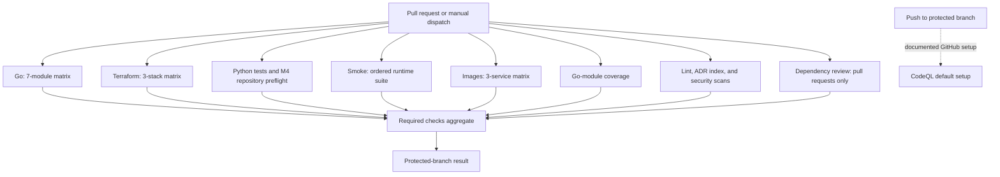

# Repository file checks

Assessed against the tracked CI, Makefile, checker scripts, and dependency
manifests on **2026-09-13**. This inventory describes configured coverage; it
doesn't certify a new CI run or remote branch-protection settings.

This repository checks source files, generated artifacts, infrastructure
contracts, and running behavior. The checks fall into 4 groups:

- `make lint` runs the static linters and repository-owned documentation check.
- `make test` runs Go tests with the race detector, including the Kubernetes
  manifest tests, then the Python `unittest` suite.
- GitHub Actions adds Terraform validation, image builds, dependency review,
  module discovery, and end-to-end checks.
- The remaining `make ...verify...` targets exercise behavior that needs a
  running stack or cluster.

Run the checks touched by a change. The usual local set is:

```bash
make lint
make test
make terraform-check
make k8s-validate
make smoke
```

`make smoke` needs the local stack. None of these commands creates cloud
resources or contacts AWS. `make k8s-validate` needs Docker, Helm, kubectl, and
network access on its first run to fetch pinned validation inputs. See
[costs.md](costs.md) before running any real-AWS target.

## Full CI workflow

The tracked workflow is [`.github/workflows/ci.yml`](../.github/workflows/ci.yml).
It runs for pull requests and manual `workflow_dispatch` requests. It has no
`push` trigger. Comments in the workflow record that the protected branch
requires its aggregate result on an up-to-date pull request and that
GitHub-managed CodeQL default setup handles push scanning separately.

The workflow applies these controls to every job:

- Repository permissions are limited to `contents: read`.
- Every referenced action is pinned to a full commit SHA.
- Checkout credential persistence is disabled.
- The concurrency key contains the workflow and pull-request number or Git
  reference. A newer run cancels an older in-progress run for the same key.
- No job receives real AWS credentials. Terraform initializes with its backend
  disabled, and the smoke job uses local emulator credentials.

### CI topology

A flowchart is useful here because the workflow fans out into 8 prerequisite
job groups and then folds their results into 1 branch-protection result. GitHub
[renders Mermaid diagrams in Markdown files](https://docs.github.com/en/get-started/writing-on-github/working-with-advanced-formatting/creating-diagrams),
so the diagram stays editable beside the workflow it describes.



The 3 matrices expand the 9 tracked job definitions into 19 job instances on a
pull request: 7 Go jobs, 3 Terraform jobs, Python, smoke, 3 image jobs, module
coverage, lint, dependency review, and the aggregate. A manual run has the same
shape with dependency review skipped.

### Job inventory

| Job | Expansion | Timeout | Work performed |
|---|---:|---:|---|
| `go` | 7 modules | 15 minutes | Format, build, vet, module tidiness, golangci-lint, and tests. |
| `terraform` | 3 stacks | 15 minutes | Format, backend-free initialization, configuration validation, and stack tests where present. |
| `python` | 1 | 5 minutes | Python tests, the Go-backed live-run Make entry-point check, and the account-independent M4 repository preflight. |
| `smoke` | 1 | 30 minutes | Start the local platform and run smoke, trace, replay, ordering, drain, and crash checks. |
| `image` | 3 services | 20 minutes | Pull each pinned build base, build the service image, and verify its commit label. |
| `go-modules-covered` | 1 | 5 minutes | Compare discovered `go.mod` files with the Go matrix. |
| `lint` | 1 | 20 minutes | Run format, documentation, infrastructure, and security checks in strict mode against a full-history checkout; the Go matrix supplies golangci-lint. |
| `dependency-review` | 1 | 10 minutes | Inspect pull-request dependency changes; skip on manual dispatch. |
| `required` | 1 | 5 minutes | Combine every prerequisite result into the protected-branch result. |

### Go matrix

The Go matrix covers:

- `services/smoke`
- `services/echo`
- `services/relay`
- `services/sink`
- `k8s/validate`
- `tools/m4-bootstrap`
- `tools/m4-live-run`

Each matrix job checks out the repository, installs the Go version named by
that module's `go.mod`, and runs:

1. `gofmt -l .`, failing when it prints any path.
2. `go build ./...`.
3. `go vet ./...`.
4. `go mod tidy`, followed by a clean-diff assertion for `go.mod` and `go.sum`.
5. golangci-lint 2.13.1 with the root `.golangci.yml`.
6. `go test -race -count=1 ./...` with `RELAY_STORE_TESTS_OPTIONAL=1`.

The `k8s/validate` matrix job also runs the schema and service-configuration
script after its Go tests. SQL integration tests may skip in the Go matrix;
the smoke job requires them against seeded Postgres.

The live-run module tests its deadline arithmetic, bounded apply signal
sequence, process-group delivery, pending-signal reset, state heartbeat,
exclusive lock, identity retries, Terraform-state check, explicit inventory,
and the split between resource cleanup and evidence-command failures.

The matrix is written explicitly because GitHub needs it before steps run. The
`go-modules-covered` job independently discovers every `go.mod` and compares
the result with that matrix. It reports both missing modules and stale entries.

### Terraform matrix

The Terraform matrix covers:

- `infra/terraform/bootstrap`
- `infra/terraform/guardrails`
- `infra/terraform/envs/dev`

Each job installs Terraform 1.16.3 and runs:

```bash
terraform fmt -check -recursive
terraform init -backend=false -input=false
terraform validate
terraform test # guardrail and dev stacks
```

The disabled backend avoids remote state. The workflow has no AWS credentials,
so this job cannot plan or apply real infrastructure.

### Smoke job

The smoke job has an ordered setup and verification path:

1. Install Go and a container-backed BuildKit builder.
2. Warm the relay and sink build-stage base images.
3. Pull the third-party Compose images, retrying registry operations up to 3
   times.
4. Start the core and messaging profiles and wait for their health checks.
5. Seed emulator resources, Kafka topics, and relay subscriptions.
6. Run `go test -count=1 ./internal/subscriptions ./internal/history` in
   `services/relay`; unavailable Postgres fails this CI step.
7. Build relay and sink through Docker Bake with separate GitHub cache scopes.
8. Start relay and the sink without rebuilding.
9. Run the smoke program with tracing explicitly optional and no observability
   profile running.
10. Start the observability profile.
11. Run the smoke program again with tracing required, checking one Tempo trace
    across ingest, Kafka, and every delivery attempt.
12. Verify replay of acknowledged events.
13. Verify steady-state per-tenant ordering with the established shell gate.
14. Run the Go ordering pilot against the same live stack and contract.
15. Verify graceful shutdown drains and commits the current record.
16. Verify a crash in the delivery-to-commit window causes redelivery.
17. On failure, print the final 100 lines from each Compose service.
18. Always stop the Compose stack and delete its volumes.

The initial no-observability run and the later trace-required run test 2
different contracts. The first proves the application continues without a
collector. The second proves the complete trace exists when the collector and
Tempo are available.

### Image matrix

The image matrix covers `echo`, `relay`, and `sink` with `fail-fast: false`, so
one service failure does not cancel the other builds. Each job reads every
non-`scratch` base from its Dockerfile, retries each pull up to 3 times, and
runs:

```bash
docker build --build-arg VERSION="$GITHUB_SHA" -t <service>:ci services/<service>
```

Each image's `org.opencontainers.image.revision` label must equal
`GITHUB_SHA` when read back with `docker inspect`.

### Lint and dependency jobs

The lint job checks out full Git history and runs `make lint` with:

```text
LINT_STRICT=1
LINT_SKIP_OK=golangci-lint
```

Strict mode fails an unavailable checker. The declared golangci-lint exception
exists because every Go matrix job already runs the pinned linter action.

The repository-owned ADR index runs inside this job after markdownlint. It
discovers the ADR files and their `Status:` values, then compares them with the
README table. The check has no missing-tool skip path. A missing, stale,
duplicate, or wrong-status entry fails the `lint` job and therefore the
aggregate result.

Dependency review runs only for pull requests. It uses the pinned
`actions/dependency-review-action` with its default configuration.

### Aggregate result

The `required` job uses `if: always()` and waits for Go, Terraform, Python,
smoke, images, Go-module coverage, lint, and dependency review. It accepts `success`
or `skipped` from each prerequisite and fails on every other result. The
expected skip is dependency review during a manual dispatch.

The workflow is designed for this aggregate to be the single result consumed
by branch protection. Failure details remain attached to the individual job
that found the problem. Tracked files do not prove the current remote branch
rule.

## Static checks: `make lint`

`make lint` runs [`scripts/lint.sh`](../scripts/lint.sh). The script prefers a
local binary when its reported version matches the repository pin. Most checks
fall back to a pinned container when the local binary is absent or has another
version.

On a developer machine, a checker that cannot run is reported as `SKIP`. CI
sets `LINT_STRICT=1`, which turns an unexpected skip into a failure. CI permits
one declared exception: `golangci-lint` runs through its own pinned action in
the Go job.

### YAML: yamllint 1.37.1

The YAML check runs:

```bash
yamllint -f parsable .
```

The configuration in [`.yamllint.yml`](../.yamllint.yml) extends yamllint's
default rules and makes these repository choices:

- Document-start markers are optional.
- Boolean checking accepts `true` and `false` and does not inspect keys. This
  avoids treating the GitHub Actions `on:` key as a YAML 1.1 boolean.
- Lines may be up to 120 characters. A long, unbreakable word is allowed, and
  line-length findings are warnings.
- Inline comments need at least 1 space before the comment.
- Mapping and sequence indentation must be internally consistent.

The check ignores `.terraform` directories and the generated
`k8s/manifests/monitoring/dashboard-relay.yaml`. The generated file contains a
Grafana JSON block whose lines should stay byte-for-byte equal to the source
dashboard. The Kubernetes tests parse the generated YAML and check that
contract instead.

### Python: Ruff 0.16.6

`ruff check .` uses [`ruff.toml`](../ruff.toml), which explicitly selects `F`
(Pyflakes), `E9` (syntax/runtime-error rules), `B` (flake8-bugbear), and `DTZ`
(flake8-datetimez). This is a lint gate; the script doesn't run Ruff formatting
or a Python type checker.

The script accepts a matching native Ruff binary or runs
`ghcr.io/astral-sh/ruff:0.16.6` through Docker.

### Shell: ShellCheck 0.11.0

The script discovers every `*.sh` file recursively, excluding `.terraform`
directories, then runs ShellCheck over the complete list. This includes:

- local bootstrap scripts;
- ArgoCD installation and repository-credential scripts;
- dashboard generation and monitoring probes;
- relay demos, replay tools, and behavioral verification scripts.

GitHub Actions `run:` blocks are checked by actionlint separately. ShellCheck's
file discovery covers standalone shell scripts.

### Markdown: markdownlint-cli2 0.23.2

Markdownlint checks every `**/*.md` file, excluding `.terraform` and
`node_modules`. [`.markdownlint-cli2.jsonc`](../.markdownlint-cli2.jsonc)
enables the default rule set with these exceptions:

- `MD013`, line length, is disabled. Tables, links, and commands can exceed the
  prose wrapping width.
- `MD060`, table column style, is disabled.
- `MD034`, bare URLs, is disabled.
- `MD024`, duplicate headings, applies only among sibling headings.

The repository currently has no Markdown link checker.

### ADR index: repository-owned check

[`scripts/check-adr-index.sh`](../scripts/check-adr-index.sh) discovers every
numbered `docs/adr/*.md` file and every numbered ADR link in the README's
“Design and evidence” section. It fails when:

- an ADR file is missing from the README;
- the README links to an ADR file that does not exist;
- the README lists one ADR more than once;
- an ADR has no `Status:` line, more than 1 status line, or an empty status;
- the status displayed by the README differs from the ADR's declared status;
- the README section or ADR directory is absent;
- no numbered ADR files are discovered.

The comparison uses the 2 discovered path sets. It stores no expected ADR
count, filename list, or highest sequence number. A passing result prints the
current discovered count and a summary of the declared statuses for visibility.

Each ADR's `Status:` line is the source of truth. The README exposes the same
value in its ADR table. The check derives the value from each record and does
not carry an allowed-status list, so states can change without editing the
checker.

The check permits a README link to include a heading fragment and removes that
fragment before comparing paths. It checks index membership, uniqueness, and
status. It does not require consecutive ADR numbers or compare link text with
ADR titles.

### GitHub Actions: actionlint 1.7.12

Actionlint checks workflow YAML under `.github/workflows`. Its coverage
includes workflow structure, expressions, job references, action inputs, and
shell embedded in `run:` blocks when ShellCheck is available to actionlint.
The native path relies on the host's auxiliary checker installation.

Yamllint still checks the same workflow files for general YAML rules.

### Dockerfiles: Hadolint 2.15.1

The lint script discovers every file named `Dockerfile`, excluding
`.terraform`, and checks each one with Hadolint. The check covers Dockerfile
syntax and Hadolint's default Docker and shell rules.

### Terraform formatting: Terraform 1.16.3

The lint script runs:

```bash
terraform fmt -check -recursive infra/terraform
```

This fails when any tracked Terraform file differs from Terraform's canonical
format.

### Terraform rules: TFLint 0.64.0

TFLint runs in all 3 Terraform stacks:

- `infra/terraform/bootstrap`
- `infra/terraform/guardrails`
- `infra/terraform/envs/dev`

Each stack runs:

```bash
tflint --init
tflint --format compact
```

The configuration in [`.tflint.hcl`](../.tflint.hcl) enables the recommended
Terraform rules and AWS ruleset 0.44.0. The AWS plugin can catch provider
mistakes such as invalid values and deprecated AWS arguments that formatting
alone cannot see.

TFLint runs through Docker in the lint script. Its plugin download is retried
3 times. A diagnosed GitHub release-download failure is reported as a visible,
allowed skip because it says nothing about the Terraform configuration.

### Go: golangci-lint 2.13.1

The lint script discovers every directory containing `go.mod`, excluding
`.terraform` and `node_modules`, and runs:

```bash
golangci-lint run --config ../../.golangci.yml --timeout 5m
```

The repository configuration includes errcheck, staticcheck, unused, and
ineffassign. CI runs the same linter version once per Go module through
`golangci/golangci-lint-action`.

### Security: Trivy 0.74.0

Trivy uses a cache under
`${TMPDIR:-/tmp}/mlp-trivy-cache-<checks-digest>`. Before scanning, the lint
script prepares 2 inputs:

1. The vulnerability database, through `trivy image --download-db-only`.
2. The misconfiguration checks bundle, through a harmless `trivy config` scan
   against an empty input directory. The bundle repository is pinned to an OCI
   digest in `scripts/lint.sh`.

The default bundle tag is mutable, and Trivy checks a cached bundle for
registry updates at most once every 24 hours. Pinning the digest gives local and
CI runs the same policy for a given commit. Updating the rules requires changing
that pin. The digest also namespaces the cache, so a pin change starts a new
cache while repeat runs keep the downloaded database and bundle.
Changing the pin re-downloads the vulnerability database, and the script does
not automatically remove older digest-named cache directories.

Each download is retried up to 3 times. Trivy can exit successfully after a
failed bundle pull by using its embedded checks, so the script requires both
at least one Rego policy below `policy/content` and the pinned digest in
`policy/metadata.json` before scanning. A refresh failure after all 3 attempts
fails the Trivy check.

Trivy does not download a cached bundle again while its metadata names the
pinned digest. For 24 hours after `DownloadedAt` it does not ask the registry.
After that, the registry digest matches the pin, so Trivy only rewrites
`DownloadedAt`. A cache that loses its policy files but keeps
`policy/metadata.json` would fail every later run; this has happened under the
macOS `$TMPDIR`, from an unproven cause. Before the pull, the script looks for
that state: metadata naming the pinned digest and no Rego policy below
`policy/content`. When it finds it, the script deletes only
`policy/metadata.json` and prints a `NOTE` line, and the pull downloads the
bundle as it would for a new cache. The verification above still decides
whether the scan runs, so a failed or unpinned download still fails the Trivy
check.

Runs that share a cache are not isolated from each other's downloads. A
download removes `policy/content`, extracts the bundle again file by file, and
writes `policy/metadata.json` last. The final scan reads that directory without
consulting the metadata, and when the directory is missing Trivy falls back to
its embedded checks, silently under `--quiet`. A scan that starts while another
run downloads into the same cache can therefore load an incomplete or embedded
rule set. Under the current pins, Trivy 0.74.0 downloads the bundle only into a
new cache, after the repair above, or when it cannot read the metadata.

So the script checks afterwards. It creates a marker file in the cache just
before the final scan. When the scan exits, anything under `policy/` modified
after the marker, or a failure to read `policy/`, fails the Trivy check with
"checks bundle was replaced during the scan; rerun", whatever the scan itself
reported.

A download can only change what the scan loads by deleting a policy before
loading ends, and that first deletion updates the modification time of a
directory under `policy/`. With real Trivy 0.74.0 downloads, native and in the
container, the change showed up within 20 ms of the first missing policy.

The first design compared `policy/metadata.json` before and after the scan, and
it can miss the worst case. A download writes that file last: 110 to 120 ms
after its first deletion natively, and 320 to 420 ms in the container. A
container scan that found no checks exited 0 about 0.32 seconds after loading
them, so it can finish before that write. These timings are from one Mac, on
2026-09-23 and 2026-09-24.

Two gaps remain:

- Trivy's extractor resets directory times from the archive when it finishes.
  A download that deleted the old checks before the marker and, when the scan
  exits, has finished extracting but not yet written its metadata leaves
  nothing newer. Trivy 0.74.0 makes no network call between those two steps.
  The check also needs timestamps finer than the gap between the marker and a
  deletion; APFS, where it was tested, records nanoseconds.
- Once 24 hours have passed, a pull rewrites `DownloadedAt` and leaves the
  checks alone. If another run does that during a scan, the check fails a sound
  scan, and a rerun passes.

The final repository scan runs:

```bash
trivy fs \
  --scanners vuln,misconfig,secret \
  --checks-bundle-repository mirror.gcr.io/aquasec/trivy-checks@sha256:... \
  --ignorefile .trivyignore.yaml \
  --severity MEDIUM,HIGH,CRITICAL \
  --skip-dirs '**/.terraform' \
  --skip-db-update \
  --skip-check-update \
  --exit-code 1 \
  --quiet \
  .
```

The scanners have separate jobs:

- `vuln` checks package and dependency metadata that Trivy recognizes against
  the downloaded vulnerability database.
- `misconfig` checks Terraform, Kubernetes, Docker, Compose, GitHub Actions,
  and other supported configuration files against Trivy's checks bundle.
- `secret` scans repository files for credentials and other secret patterns.

The severity filter includes `MEDIUM`, `HIGH`, and `CRITICAL`; `LOW` and
`UNKNOWN` do not fail this command. `--exit-code 1` makes any included finding
fail `make lint`. The `--skip-db-update` and `--skip-check-update` options make
the final scan use the inputs fetched immediately before it, unless another run
sharing the cache replaces the checks first, as described above.

The scan skips every `.terraform` directory because those directories contain
downloaded provider and module files. The scan includes the tracked Terraform
stacks, Kubernetes and ArgoCD manifests, Dockerfiles, Compose files, workflows,
lock files, and remaining repository content.

The lint script accepts a local Trivy binary only when it reports version
0.74.0. It otherwise uses `aquasec/trivy:0.74.0` when Docker is available. The
container runs with the invoking user's UID and GID so its cache files remain
writable by that user.

#### Accepted Trivy findings

The repository has 4 inline Terraform suppressions and 3 entries in
`.trivyignore.yaml`. The file-based entries cover 5 Kubernetes manifest paths.

| Location | Rule | Recorded reason |
|---|---|---|
| `envs/dev`, artifacts S3 bucket | `AWS-0132` | SSE-S3 is sufficient for disposable artifacts; a customer-managed KMS key adds a monthly cost. |
| `envs/dev`, artifacts S3 bucket | `AWS-0090` | Versioning is disabled for disposable objects that expire after 30 days; the state bucket is versioned. |
| `envs/dev`, SNS topic | `AWS-0136` | The AWS-managed SNS key encrypts the topic; a customer-managed key adds a monthly cost. |
| `bootstrap`, state-bucket encryption configuration | `AWS-0132` | State uses SSE-S3 AES-256; a customer-managed key adds a monthly cost for this personal development stack. |
| Relay and sink base Deployments | `KSV-0125` | Their non-routable digest fixtures are replaced by validated local or AWS overlays. |
| AWS OpenTelemetry Collector Deployment | `KSV-0125` | This versioned upstream image is already exercised by the local stack; the project has no private image mirror. |
| AWS Tempo Deployment | `KSV-0125` | This versioned upstream image is already exercised by the local stack; the project has no private image mirror. |

The first 3 directives are in
[`infra/terraform/envs/dev/main.tf`](../infra/terraform/envs/dev/main.tf). The
bootstrap directive is in
[`infra/terraform/bootstrap/main.tf`](../infra/terraform/bootstrap/main.tf).
The Kubernetes entries and their exact paths are in
[`.trivyignore.yaml`](../.trivyignore.yaml).

Accepted Terraform findings carry inline `#trivy:ignore:` directives with the
reason. A directive must sit on the resource Trivy reports and must be the last
comment line before that resource. Prose after the directive or a directive on
another resource silently disables the suppression.

### Secrets: Gitleaks 8.30.1

Gitleaks runs:

```bash
gitleaks detect --source=. --no-banner --redact
```

CI checks out full history before `make lint`, so Gitleaks can detect a secret
that was committed and later removed. Findings are redacted in command output.
Gitleaks scans the history of every ref (`git log --all`), including other
worktrees' `HEAD` commits. The checked-out `.gitleaks.toml` applies to all of
it.

Gitleaks accepts a local binary only when it reports version 8.30.1. Its Docker
fallback is `zricethezav/gitleaks:v8.30.1`. In a linked git worktree, `.git` is
a file that points into the main repository's git directory, outside the
checkout the container mounts. So the fallback also mounts the common git
directory, read-only, at its host path, where that pointer leads. In a
normal clone that directory is already inside the checkout. A worktree created
with relative paths (`git worktree add --relative-paths`) still cannot be read
in the container, and the count check below fails it.

Gitleaks 8.30.1 exits 0 when git cannot read the repository: it logs the git
error, then reports "0 commits scanned" and "no leaks found". The script fails
the check when Gitleaks exits 0 without scanning a commit. The count leaves out
commits with no text diff to scan, such as merges, so it doesn't line up with
`git rev-list --count HEAD`, and the script checks only that it's above zero.

#### Accepted Gitleaks findings

[`.gitleaks.toml`](../.gitleaks.toml) keeps every default rule and allows one
line shape: `"secret_scan_sha256": "<64 hex characters>"`. Published M4 evidence
records that field as the SHA-256 of the private secret-scan report. The key
contains "secret", so the default `generic-api-key` rule reports the digest as a
credential. It is a digest, and the published packet is hash-bound, so the field
cannot be renamed. The same kind of value under any other key is still
reported.

## Go build and test checks

The Makefile discovers all Go modules from their `go.mod` files.

### Local commands

```bash
make fmt
make vet
make tidy
make test
```

- `make fmt` runs `go fmt ./...` in every module.
- `make vet` runs `go vet ./...` in every module.
- `make tidy` runs `go mod tidy` in every module.
- `make test` runs `go test -race ./...` in every module. It adds `-count=1`
  for `k8s/validate` because those tests read files outside Go's test-cache
  inputs, then runs `PYTHONDONTWRITEBYTECODE=1 python3 -m unittest discover
  -s scripts/tests`.

The relay SQL tests skip when Postgres is unreachable on a normal local run.
With `CI` set, missing Postgres fails unless `RELAY_STORE_TESTS_OPTIONAL` is
also set. Reachable Postgres must have the seeded relay schema and subscription
data; see [the smoke job](#smoke-job) for the mandatory CI execution.

### CI Go job

See [Go matrix](#go-matrix) for the complete format, build, vet, tidy, lint,
race-test, and module-coverage gates. Local `make fmt` and `make tidy` write
files; the CI equivalents reject unformatted or untidy changes.

## Security-sensitive behavior tests

`make test` and the CI Go job exercise security properties that static scanners
cannot prove.

### Webhook authentication and replay defense

The sink tests cover the complete webhook verification boundary:

- A valid version-1 HMAC-SHA256 signature is accepted.
- A wrong secret, changed body, changed event ID, changed timestamp, missing
  headers, missing signature, unknown signature version, missing version
  prefix, or non-numeric timestamp is rejected.
- A correctly signed request outside the 5-minute tolerance window is rejected
  whether it is too old or too far in the future.
- A signature inside the tolerance window is accepted.
- During secret rotation, a header containing several signatures is accepted
  when at least 1 version-1 signature verifies. A header containing only stale
  signatures is rejected.
- An unverified delivery does not enter the sink's delivery history or metrics.

Relay tests also assert that every retry has a verifiable signature, keeps the
same webhook ID, and refreshes the timestamp used in that attempt's signature.

See [`services/sink/main_test.go`](../services/sink/main_test.go) and
[`services/relay/internal/delivery/deliver_test.go`](../services/relay/internal/delivery/deliver_test.go).

### Secret and sensitive-data containment

The Go tests assert:

- A subscription's string form never contains its signing secret.
- A dead-letter record never contains the subscription signing secret.
- Transport-error spans exclude the subscriber URL path and query string.
- Telemetry error recording excludes raw error messages, subscriber URLs,
  tokens, tenant IDs, and caller-supplied idempotency keys.
- Ingest conflict spans exclude the caller's idempotency key.
- Smoke-check spans exclude endpoint details, response bodies, tenant names,
  event IDs, and secret-looking values returned by a check.
- Relay installs only `traceparent` and `tracestate` propagation. It does not
  forward arbitrary caller baggage into Kafka or subscriber requests.

These assertions live in:

- [`services/relay/internal/subscriptions/store_test.go`](../services/relay/internal/subscriptions/store_test.go)
- [`services/relay/internal/delivery/consumer_test.go`](../services/relay/internal/delivery/consumer_test.go)
- [`services/relay/internal/telemetry/telemetry_test.go`](../services/relay/internal/telemetry/telemetry_test.go)
- [`services/relay/internal/ingest/server_test.go`](../services/relay/internal/ingest/server_test.go)
- [`services/smoke/internal/checks/runner_test.go`](../services/smoke/internal/checks/runner_test.go)

The subscription tests also reject delivery URLs without an `http` or `https`
scheme or without a host. This check does not block internal or private network
addresses; subscription URLs are operator-supplied configuration.

## Kubernetes manifest checks

Run:

```bash
make k8s-validate
```

This executes `go test -count=1 ./...` in `k8s/validate`, then runs
`scripts/validate-k8s-schema.sh`. Always keep `-count=1`: the tests read YAML
and shell files that Go's test cache does not track.

The tests discover every directory under `k8s/manifests` containing a
`kustomization.yaml`. Each directory is rendered with `kubectl kustomize`, and
the rendered YAML must parse and contain at least 1 document.

The schema script separately discovers every Kustomize root under
`k8s/manifests`, `k8s/aws`, and `k8s/apps/aws`. It renders those roots, the
generated runtime, replay, and AWS root Application, and the pinned
kube-prometheus-stack chart with Helm's `--kube-version 1.36.0`.
Kubeconform 0.8.0 runs with `-strict`, `-summary`,
`-ignore-missing-schemas`, and Kubernetes schema version `1.36.0`. Objects
without a schema are skipped by kubeconform; focused Go tests cover selected
custom-resource contracts.

Because Kubernetes schema validation cannot parse configuration embedded inside
ConfigMaps, the script also asks the exact pinned Tempo and OpenTelemetry Collector images to
validate their own configuration files.

This gate needs Docker, Helm, and kubectl. The first run contacts container,
chart, and schema registries to download pinned inputs; later runs may use
local caches. It never contacts a Kubernetes cluster or AWS and creates no
cloud resources.

The rendered-manifest tests assert:

- Every workload directory contains a Deployment. `monitoring` is the declared
  exception because its workloads come from kube-prometheus-stack.
- A Deployment selector contains the application name and excludes
  `app.kubernetes.io/managed-by`. That label is mutable and cannot enter an
  immutable selector.
- Every pod template carries `app.kubernetes.io/managed-by=argocd`.
- Every container has readiness and liveness probes.
- Every local `:dev` image uses `imagePullPolicy: IfNotPresent`.
- Every Service selector matches pods created by a Deployment in the same
  rendered directory.
- Every Kafka ScaledObject has `maxReplicaCount` equal to the referenced
  topic's partition count in `local/bootstrap/kafka-topics.sh`.
- Relay's delivery schedule fits inside its record deadline and Kubernetes
  termination grace period.
- Relay's ingest and delivery drain budgets fit inside their Deployment grace
  periods.

These tests live in:

- [`k8s/validate/manifests_test.go`](../k8s/validate/manifests_test.go)
- [`k8s/validate/scaledobject_test.go`](../k8s/validate/scaledobject_test.go)
- [`k8s/validate/graceperiod_test.go`](../k8s/validate/graceperiod_test.go)

## ArgoCD checks

The ArgoCD tests read the manifests under `k8s/argocd`, discover every child
Application under `k8s/apps`, and inspect the installation scripts. They
assert:

- `default-project.yaml` grants no source repositories, source namespaces,
  destinations, cluster resources, or namespace resources. Its namespace
  blacklist denies every group and kind.
- `root-project.yaml` defines `mlp-root`, reads only `__REPO_URL__`, deploys
  only into `argocd`, grants no cluster resources, and permits only ArgoCD
  `Application` objects at namespace scope.
- `project.yaml` defines `mlp`, reads only `__REPO_URL__`, deploys only into
  namespace `mlp`, and grants cluster scope only for the `mlp` Namespace.
- `root-app.yaml` uses project `mlp-root`, reads `k8s/apps`, and targets the
  in-cluster `argocd` namespace.
- Every `k8s/apps/*.yaml` child uses project `mlp`, the repository configured
  by `install.sh`, and the in-cluster `mlp` namespace.
- `install.sh` fixes ArgoCD at `v3.5.1` and does not permit a version override.
- The Makefile and `install.sh` carry the same default repository URL.
- `install.sh` and `repo-creds.sh` apply the migration files in this order:

  1. `root-project.yaml`
  2. `root-app.yaml`
  3. `project.yaml`
  4. `default-project.yaml`

The implementation is in
[`k8s/validate/argocd_projects_test.go`](../k8s/validate/argocd_projects_test.go).
ShellCheck covers both ArgoCD shell scripts, while yamllint and Trivy cover the
manifests.

These checks inspect repository state. CI does not install ArgoCD or assert a
live reconciliation. `make k8s-status` displays the current Applications and
workloads for an operator. It always acts as an informational command.

## JSON and generated-dashboard checks

The repository has no general `*.json` syntax gate. The Grafana dashboard has
its own contract because it is the JSON artifact shipped by the platform.

`make monitoring-dashboard` runs
[`scripts/gen-dashboard-configmap.sh`](../scripts/gen-dashboard-configmap.sh).
The generator parses
`local/config/grafana/provisioning/dashboards/relay.json` with Python's
`json.load` before writing the ConfigMap. Invalid JSON stops generation.

`make k8s-validate` then asserts:

- The generated ConfigMap's `relay.json` payload equals the source file byte
  for byte.
- The embedded payload is valid JSON.
- The dashboard UID remains `relay-delivery`, which is the URL used by the demo
  and runbook.
- The dashboard contains at least 1 panel.
- The ConfigMap carries `grafana_dashboard: "1"`, which makes the Grafana
  sidecar collect it.

The tests are in
[`k8s/validate/dashboard_test.go`](../k8s/validate/dashboard_test.go).
Other JSON and JSONC files still receive the repository-wide Trivy and Gitleaks
scans when those tools recognize their contents.

## Terraform validation in CI

See [Terraform matrix](#terraform-matrix) for the 3 stacks and commands.
`make terraform-check` runs the same sequence with the installed supported
Terraform version; CI installs 1.16.3.

`terraform validate` checks parsing, references, types, and provider schemas.
The guardrail stack's mocked test fixes the persistent budget's name, limit,
and 3 notifications. The dev stack's mocked tests assert that the default has
no hourly resources and the enabled plan matches ADR 0010.

Backend-free initialization still downloads providers and modules. The
repository's cost guardrails apply to any real-AWS operation; validation
provides no authorization to apply infrastructure.

## M4 preflight checks in CI

The Python job runs every test under `scripts/tests`, then runs
`make aws-preflight-check` from a full-history checkout. That check requires
the recorded M3 closure commit in `HEAD`'s history, rejects an enabled hourly
Terraform flag, renders the AWS Application, runtime ConfigMap, and replay Job,
checks the tracked AWS manifests for local endpoints and floating image tags,
checks the raw and sanitized evidence roots, and dry-runs `make aws-down` to
verify the state-backed destroy path. It also checks the fixed evidence order,
the provisional and final file sets, the required visual sequence, and the rule
that optional AWS-console screenshots yield to the destroy deadline.

The Python tests exercise the M4 evidence publisher with a local fixture. They
require a human review record for the 4 visual captures, reject malformed or
small screenshots, redact known and structural sensitive values, preserve
commit and image identifiers, hash each published file, and detect edits after
publication. No test reads an AWS account.

They also execute the `aws-live-status` Make entry point against an invalid
run id, so the nested Go module must start before the expected validation
failure. Separate local-only cases check floating-point budget thresholds,
stale controller heartbeats, stale guardrail-plan removal, plan consumption,
and the cheap-tier confirmation prompt.

They also exercise the minikube SIGTERM receipt helpers without a cluster.
Those cases require application readiness to fail before a clean container
exit, reject explicit signals and grace-period overruns, accept completed or
safe at-least-once delivery, normalize Kubernetes' omitted signal field, and
keep local rehearsal receipts outside the exact live-packet allowlist.

The local abort tests send a real SIGTERM to a child holding mode-0600
credential files and simulated hourly state. They require destroy, explicit
inventory, immediate cost capture, and credential removal in order; reject a
destroy recipe without its state backup; and keep the receipt outside the live
packet. The child never receives an AWS credential or contacts AWS.

The local demo tests keep rehearsal output in its private, canonical run
directory, require provenance for every ready relay and sink pod, and reject a
fixed replica count. Relay demo tests also pin the deployed runtime ConfigMap
name and ensure lag freshness excludes the default-zero gauge exported by
non-ingest relay processes. The live runner refuses the wrong context, running
Compose app containers, missing pods, mismatched image revisions, or leftover
KEDA pause state before it produces an event.

The other account-independent parts of `make aws-preflight` stay in their
existing CI jobs: Go and Python tests, strict lint, all 3 Terraform stacks, the
3 service-image builds, and rendered Kubernetes validation. Presence checks
for operator tools remain local because the hosted jobs install only what each
job uses. The workflow receives no AWS credentials and creates no local
cluster.

## Container-image checks

See [Image matrix](#image-matrix) for pinned-base pulls, service builds, and
revision-label verification. Hadolint checks the Dockerfiles separately.

## End-to-end CI checks

See [Smoke job](#smoke-job) for the ordered SQL, round-trip, trace, replay,
ordering, drain, and crash checks, including teardown. These tests need the
seeded Compose stack and run in addition to Go unit tests.

## Operator-run behavioral checks

These commands require a running local stack or cluster and are available for
focused verification:

| Command | What it checks |
|---|---|
| `make smoke` | End-to-end round trips through the configured local services. |
| `make smoke-traces` | The smoke checks plus the required relay trace in Tempo. |
| `make monitoring-ready` | Prometheus is scraping `relay-deliver` and the demo query has data. |
| `make relay-replay-verify` | Delivery, history removal, replay, and return of the same event IDs. |
| `make relay-verify-ordering` | One tenant's events arrive in acceptance order. |
| `make relay-verify-ordering-go` | The Go pilot checks the same steady-state ordering contract. |
| `make relay-verify-graceful-drain` | SIGTERM drains, commits, and exits cleanly during an in-flight record. |
| `make relay-verify-duplicate-on-crash` | SIGKILL during the commit window redelivers the same webhook ID. |
| `make relay-verify-head-of-line` | Head-of-line blocking stays member-scoped; the measurement identifies its partition effect. |
| `make relay-verify-ordering-rebalance` | Ordering survives a real consumer-group membership change. |

The head-of-line and rebalance checks measure timing and real group behavior,
so CI does not run them. They are investigation and demonstration tools.

## Dependency, CodeQL, and aggregate checks

Dependency review and the protected-branch aggregate are described under
[Lint and dependency jobs](#lint-and-dependency-jobs) and
[Aggregate result](#aggregate-result).

The CI workflow records that GitHub CodeQL default setup scans pushes to the
protected branch. CodeQL configuration and query selection live in GitHub,
outside this repository. Their exact settings cannot be verified from tracked
source.

[`.github/dependabot.yml`](../.github/dependabot.yml) proposes weekly grouped
updates for:

- GitHub Actions;
- Compose images;
- the `echo`, `relay`, and `sink` Dockerfiles;
- all 3 Terraform stacks;
- all 7 Go modules.

Dependabot creates update proposals and reports no pass/fail result. Proposed
updates still pass through the pull-request gates described in this document.

The [workflow controls](#full-ci-workflow) are configured directly. No separate
repository test currently asserts every action pin or permission entry.

Vulnerability reports follow [`.github/SECURITY.md`](../.github/SECURITY.md),
which directs reporters to GitHub's private vulnerability-reporting form. The
policy provides reporting instructions and has no executable gate.

## Libraries and execution dependencies

Checker versions appear in the check sections above. This table records the
runtime and installation dependencies needed to execute those checks.

| Checks | Required dependencies |
|---|---|
| `make` targets and shell checks | Make, Bash, Git, and standard shell utilities. Replay, ordering, drain, and crash scripts also use curl and Python 3. |
| YAML lint | Python plus `yamllint==1.37.1`, installed with its package dependencies; or Docker and `pipelinecomponents/yamllint:0.35.10`. |
| Python lint | Native Ruff 0.16.6 or Docker with its pinned Ruff image. The selected flake8/Pyflakes rule families are built into Ruff and need no separate plugins. |
| Markdown lint | `markdownlint-cli2` 0.23.2 with Node.js and its npm dependency tree; Docker image `davidanson/markdownlint-cli2:v0.23.2`; or `npx --yes markdownlint-cli2@0.23.2`. |
| ADR index | Bash and standard shell utilities, through `scripts/check-adr-index.sh`; no package library. |
| ShellCheck, actionlint, Hadolint, golangci-lint, Trivy, Gitleaks | Matching native binaries or the pinned container fallbacks in `scripts/lint.sh`. Actionlint's embedded-shell analysis uses ShellCheck when available. Go analysis also needs the module dependency graph. |
| Go formatting, build, vet, tidy, and tests | Go 1.27 as declared by each `go.mod` (1.27.0 in 6 modules and 1.27 in `tools/m4-bootstrap`), module downloads, and a race-detector-capable host with cgo/C compiler support for `-race`. |
| Python tests and repository preflight | Python 3.14 in CI; standard-library `unittest`, JSON, hashing, subprocess, and filesystem libraries. Git history, Make, and Go are needed by the preflight and Make-entry-point tests. CI installs no third-party Python requirements for this job. |
| Terraform format, validate, and mocked tests | Terraform 1.16.3 in CI; provider and module downloads during backend-free initialization. Versions are detailed below. |
| TFLint | Docker image `ghcr.io/terraform-linters/tflint:v0.64.0`, built-in recommended Terraform rules, and AWS ruleset 0.44.0 downloaded by `tflint --init`. The lint script has no native TFLint path. |
| Kubernetes rendering and invariants | Go and the YAML libraries below, kubectl's Kustomize renderer, Helm, Docker, Python 3, and `kube-prometheus-stack` chart 88.5.4. |
| Kubernetes schemas and embedded telemetry configuration | Digest-pinned kubeconform 0.8.0 image, downloaded Kubernetes 1.36.0 schemas, Tempo 3.0.3, and OpenTelemetry Collector Contrib 0.159.0. The schema script runs the service binaries directly in Docker. |
| Dashboard generation and validation | Python standard-library `json` for generation; Go standard-library JSON plus the Kubernetes YAML libraries for the source/ConfigMap contract. |
| Container builds and smoke suite | Docker Engine, Compose, Buildx/BuildKit, AWS CLI and curl for emulator seeding, service Go modules, pinned Dockerfile build images, and the Compose images below. SQL tests require seeded Postgres in the smoke job. |
| Security scanning | Trivy vulnerability database and digest-pinned checks bundle; full checkout history for Gitleaks in CI. These data downloads are separate from executable installation. |
| Dependency review | GitHub Actions runner and SHA-pinned `actions/dependency-review-action` v5.0.0; no locally installed application library. |

The workflow uses `ubuntu-latest`; host utilities such as Docker, Helm,
kubectl, AWS CLI, and the C compiler aren't given a complete version lock by the tracked
workflow. Install Python/npm tools with their resolved package dependencies;
this repository doesn't separately lock those tools' transitive packages.

### Go libraries

The complete dependency graphs and checksums live in each module's `go.mod`
and `go.sum`. The libraries directly supporting validation and runtime tests
are:

| Library | Recorded version | Check or runtime exercised |
|---|---|---|
| `sigs.k8s.io/yaml` | 1.6.0 | Kubernetes YAML decoding; depends on `go.yaml.in/yaml/v2` 2.4.2. `k8s/validate` also replaces its relay-module dependency with the local source. |
| `github.com/jackc/pgx/v5` | 5.10.0 | Postgres round trips and relay store integration tests. |
| `github.com/segmentio/kafka-go` | 0.4.51 | Kafka round trips, replay, ordering, and consumer checks. |
| `github.com/rabbitmq/amqp091-go` | 1.14.0 | RabbitMQ round trips in the smoke program. |
| `github.com/aws/aws-sdk-go-v2` | 1.46.0 | Emulator API checks, with config 1.33.3, credentials 1.20.3, S3 1.111.0, SES 1.41.0, SNS 1.46.0, and SQS 1.51.0 modules. |
| `github.com/aws/aws-msk-iam-sasl-signer-go` | 1.0.4 | Relay's MSK IAM authentication code, compiled and tested with the relay module. |
| `go.opentelemetry.io/otel`, `/sdk`, `/trace`, and OTLP trace gRPC exporter | 1.46.0 | Trace creation, propagation, export, and sensitive-data containment tests. |
| `google.golang.org/grpc` | 1.83.2 | Relay gRPC/OTLP behavior; also resolved indirectly by the smoke module. |
| `github.com/prometheus/client_golang` | 1.24.1 | Relay's metric behavior and exposition tests. |

`services/echo`, `services/sink`, `tools/m4-bootstrap`, and `tools/m4-live-run`
have no third-party Go module requirements. Their tests use the Go standard
library; subprocess tests can still require external commands.

### Terraform providers and modules

All 3 stacks lock `hashicorp/aws` at 6.63.0. The dev stack also locks
`hashicorp/cloudinit` 2.4.0, `hashicorp/null` 3.3.1, `hashicorp/time` 0.14.1,
and `hashicorp/tls` 4.3.0 in its `.terraform.lock.hcl`.

The dev configuration declares `terraform-aws-modules/vpc/aws` with `~> 6.7`
and `terraform-aws-modules/eks/aws` with `~> 21.25`. These are version
constraints; provider lock files don't pin registry module resolutions.
Initialization can download modules even when hourly resources are disabled.

### Local integration services

[`local/docker-compose.yml`](../local/docker-compose.yml) supplies floci
2.0.1, Postgres 18-alpine, Kafka 4.3.1, RabbitMQ 4.3-management, and an Alpine
3.24 initialization container. Relay and sink are built from repository source.

The trace stage adds OpenTelemetry Collector Contrib 0.160.0, Prometheus
v3.14.0, Tempo 3.0.3, and Grafana 13.2.1. The Compose collector version differs
from the 0.159.0 AWS configuration-validation image described above. Container
tags retain their recorded precision; a tag alone doesn't establish an immutable
digest.

## Current coverage boundaries

The following boundaries are deliberate descriptions of current behavior:

- There is no repository-wide JSON syntax checker. The shipped Grafana
  dashboard has dedicated JSON checks.
- There is no Markdown link checker.
- The ADR index checks membership, uniqueness, and status. It does not enforce
  consecutive numbering or require README link text to match an ADR title.
- CI inspects ArgoCD configuration and scripts without installing ArgoCD.
- CodeQL uses GitHub default setup, whose exact settings are outside tracked
  repository files.
- Dependabot proposes updates without acting as a pass/fail gate.
- `make k8s-status` reports live state without acting as a pass/fail gate.
- Real-AWS plans, applies, and destroys sit outside routine validation and need
  the permissions described in [costs.md](costs.md) and [`AGENTS.md`](../AGENTS.md).
