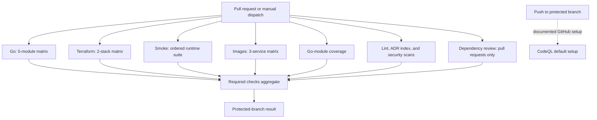

# Repository file checks

This repository checks source files, generated artifacts, infrastructure
contracts, and running behavior. The checks fall into 4 groups:

- `make lint` runs the static linters and repository-owned documentation check.
- `make test` runs every Go test, including the Kubernetes manifest tests.
- GitHub Actions adds Terraform validation, image builds, dependency review,
  module discovery, and end-to-end checks.
- The remaining `make ...verify...` targets exercise behavior that needs a
  running stack or cluster.

Run the checks touched by a change. The usual local set is:

```bash
make lint
make test
make k8s-validate
make smoke
```

`make smoke` needs the local stack. None of these commands creates cloud
resources or contacts AWS. `make k8s-validate` needs Docker, Helm, kubectl, and
network access on its first run to fetch pinned validation inputs. See
[costs.md](costs.md) before running any real-AWS target.

## Full CI workflow

The tracked workflow is [`.github/workflows/ci.yml`](../.github/workflows/ci.yml).
It runs for pull requests and manual `workflow_dispatch` requests. It has no
`push` trigger. Comments in the workflow record that the protected branch
requires its aggregate result on an up-to-date pull request and that
GitHub-managed CodeQL default setup handles push scanning separately.

The workflow applies these controls to every job:

- Repository permissions are limited to `contents: read`.
- Every referenced action is pinned to a full commit SHA.
- Checkout credential persistence is disabled.
- The concurrency key contains the workflow and pull-request number or Git
  reference. A newer run cancels an older in-progress run for the same key.
- No job receives real AWS credentials. Terraform initializes with its backend
  disabled, and the smoke job uses local emulator credentials.

### CI topology

A flowchart is useful here because the workflow fans out into 7 prerequisite
job groups and then folds their results into 1 branch-protection result. GitHub
[renders Mermaid diagrams in Markdown files](https://docs.github.com/en/get-started/writing-on-github/working-with-advanced-formatting/creating-diagrams),
so the diagram stays editable beside the workflow it describes.



The 3 matrices expand the 8 tracked job definitions into 15 job instances on a
pull request: 5 Go jobs, 2 Terraform jobs, 1 smoke job, 3 image jobs, module
coverage, lint, dependency review, and the aggregate. A manual run shows the
same shape with dependency review skipped.

### Job inventory

| Job | Expansion | Timeout | Work performed |
|---|---:|---:|---|
| `go` | 5 modules | 15 minutes | Format, build, vet, module tidiness, golangci-lint, and tests. |
| `terraform` | 2 stacks | 15 minutes | Format, backend-free initialization, and configuration validation. |
| `smoke` | 1 | 30 minutes | Start the local platform and run smoke, trace, replay, ordering, drain, and crash checks. |
| `image` | 3 services | 20 minutes | Pull each pinned build base with retries, then build the service image. |
| `go-modules-covered` | 1 | 5 minutes | Compare discovered `go.mod` files with the Go matrix. |
| `lint` | 1 | 20 minutes | Run format, documentation, infrastructure, and security checks in strict mode against a full-history checkout; the Go matrix supplies golangci-lint. |
| `dependency-review` | 1 | 10 minutes | Inspect pull-request dependency changes; skip on manual dispatch. |
| `required` | 1 | 5 minutes | Combine every prerequisite result into the protected-branch result. |

### Go matrix

The Go matrix covers:

- `services/smoke`
- `services/echo`
- `services/relay`
- `services/sink`
- `k8s/validate`

Each matrix job checks out the repository, installs the Go version named by
that module's `go.mod`, and runs:

1. `gofmt -l .`, failing when it prints any path.
2. `go build ./...`.
3. `go vet ./...`.
4. `go mod tidy`, followed by a clean-diff assertion for `go.mod` and `go.sum`.
5. golangci-lint 2.13.1 with the root `.golangci.yml`.
6. `go test -count=1 ./...`.

The matrix is written explicitly because GitHub needs it before steps run. The
`go-modules-covered` job independently discovers every `go.mod` and compares
the result with that matrix. It reports both missing modules and stale entries.

### Terraform matrix

The Terraform matrix covers:

- `infra/terraform/bootstrap`
- `infra/terraform/envs/dev`

Each job installs Terraform 1.15.8 and runs:

```bash
terraform fmt -check -recursive
terraform init -backend=false -input=false
terraform validate
terraform test # dev stack only: disabled and enabled runtime plans
PYTHONDONTWRITEBYTECODE=1 python3 -m unittest discover -s scripts/tests # dev only
```

The disabled backend avoids remote state. The workflow has no AWS credentials,
so this job cannot plan or apply real infrastructure.

### Smoke job

The smoke job has an ordered setup and verification path:

1. Install Go and a container-backed BuildKit builder.
2. Warm the relay and sink build-stage base images.
3. Pull the third-party Compose images, retrying registry operations up to 3
   times.
4. Start the core and messaging profiles and wait for their health checks.
5. Seed emulator resources, Kafka topics, and relay subscriptions.
6. Build relay and sink through Docker Bake with separate GitHub cache scopes.
7. Start relay and the sink without rebuilding.
8. Run the smoke program with tracing explicitly optional and no observability
   profile running.
9. Start the observability profile.
10. Run the smoke program again with tracing required, checking one Tempo trace
    across ingest, Kafka, and every delivery attempt.
11. Verify replay of acknowledged events.
12. Verify steady-state per-tenant ordering.
13. Verify graceful shutdown drains and commits the current record.
14. Verify a crash in the delivery-to-commit window causes redelivery.
15. On failure, print the final 100 lines from each Compose service.
16. Always stop the Compose stack and delete its volumes.

The initial no-observability run and the later trace-required run test 2
different contracts. The first proves the application continues without a
collector. The second proves the complete trace exists when the collector and
Tempo are available.

### Image matrix

The image matrix covers `echo`, `relay`, and `sink` with `fail-fast: false`, so
one service failure does not cancel the other builds. Each job reads every
non-`scratch` base from its Dockerfile, retries each pull up to 3 times, and
runs:

```bash
docker build -t <service>:ci services/<service>
```

### Lint and dependency jobs

The lint job checks out full Git history and runs `make lint` with:

```text
LINT_STRICT=1
LINT_SKIP_OK=golangci-lint
```

Strict mode fails an unavailable checker. The declared golangci-lint exception
exists because every Go matrix job already runs the pinned linter action.

The repository-owned ADR index runs inside this job after markdownlint. It
discovers the ADR files and their `Status:` values, then compares them with the
README table. The check has no missing-tool skip path. A missing, stale,
duplicate, or wrong-status entry fails the `lint` job and therefore the
aggregate result.

Dependency review runs only for pull requests. It uses the pinned
`actions/dependency-review-action` with its default configuration.

### Aggregate result

The `required` job uses `if: always()` and waits for Go, Terraform, smoke,
images, Go-module coverage, lint, and dependency review. It accepts `success`
or `skipped` from each prerequisite and fails on every other result. The
expected skip is dependency review during a manual dispatch.

The workflow is designed for this aggregate to be the single result consumed
by branch protection. Failure details remain attached to the individual job
that found the problem. Tracked files do not prove the current remote branch
rule.

## Static checks: `make lint`

`make lint` runs [`scripts/lint.sh`](../scripts/lint.sh). The script prefers a
local binary when its reported version matches the repository pin. Most checks
fall back to a pinned container when the local binary is absent or has another
version.

On a developer machine, a checker that cannot run is reported as `SKIP`. CI
sets `LINT_STRICT=1`, which turns an unexpected skip into a failure. CI permits
one declared exception: `golangci-lint` runs through its own pinned action in
the Go job.

### YAML: yamllint 1.37.1

The YAML check runs:

```bash
yamllint -f parsable .
```

The configuration in [`.yamllint.yml`](../.yamllint.yml) extends yamllint's
default rules and makes these repository choices:

- Document-start markers are optional.
- Boolean checking accepts `true` and `false` and does not inspect keys. This
  avoids treating the GitHub Actions `on:` key as a YAML 1.1 boolean.
- Lines may be up to 120 characters. A long, unbreakable word is allowed, and
  line-length findings are warnings.
- Inline comments need at least 1 space before the comment.
- Mapping and sequence indentation must be internally consistent.

The check ignores `.terraform` directories and the generated
`k8s/manifests/monitoring/dashboard-relay.yaml`. The generated file contains a
Grafana JSON block whose lines should stay byte-for-byte equal to the source
dashboard. The Kubernetes tests parse the generated YAML and check that
contract instead.

### Shell: ShellCheck 0.11.0

The script discovers every `*.sh` file recursively, excluding `.terraform`
directories, then runs ShellCheck over the complete list. This includes:

- local bootstrap scripts;
- ArgoCD installation and repository-credential scripts;
- dashboard generation and monitoring probes;
- relay demos, replay tools, and behavioral verification scripts.

GitHub Actions `run:` blocks are checked by actionlint separately. ShellCheck's
file discovery covers standalone shell scripts.

### Markdown: markdownlint-cli2 0.23.2

Markdownlint checks every `**/*.md` file, excluding `.terraform` and
`node_modules`. [`.markdownlint-cli2.jsonc`](../.markdownlint-cli2.jsonc)
enables the default rule set with these exceptions:

- `MD013`, line length, is disabled. Tables, links, and commands can exceed the
  prose wrapping width.
- `MD060`, table column style, is disabled.
- `MD034`, bare URLs, is disabled.
- `MD024`, duplicate headings, applies only among sibling headings.

The repository currently has no Markdown link checker.

### ADR index: repository-owned check

[`scripts/check-adr-index.sh`](../scripts/check-adr-index.sh) discovers every
numbered `docs/adr/*.md` file and every numbered ADR link in the README's
“Design and evidence” section. It fails when:

- an ADR file is missing from the README;
- the README links to an ADR file that does not exist;
- the README lists one ADR more than once;
- an ADR has no `Status:` line, more than 1 status line, or an empty status;
- the status displayed by the README differs from the ADR's declared status;
- the README section or ADR directory is absent;
- no numbered ADR files are discovered.

The comparison uses the 2 discovered path sets. It stores no expected ADR
count, filename list, or highest sequence number. A passing result prints the
current discovered count and a summary of the declared statuses for visibility.

Each ADR's `Status:` line is the source of truth. The README exposes the same
value in its ADR table. The check derives the value from each record and does
not carry an allowed-status list, so states can change without editing the
checker.

The check permits a README link to include a heading fragment and removes that
fragment before comparing paths. It checks index membership, uniqueness, and
status. It does not require consecutive ADR numbers or compare link text with
ADR titles.

### GitHub Actions: actionlint 1.7.12

Actionlint checks workflow YAML under `.github/workflows`. Its coverage
includes workflow structure, expressions, job references, action inputs, and
shell embedded in `run:` blocks.

Yamllint still checks the same workflow files for general YAML rules.

### Dockerfiles: Hadolint 2.15.1

The lint script discovers every file named `Dockerfile`, excluding
`.terraform`, and checks each one with Hadolint. The check covers Dockerfile
syntax and Hadolint's default Docker and shell rules.

### Terraform formatting: Terraform 1.15.8

The lint script runs:

```bash
terraform fmt -check -recursive infra/terraform
```

This fails when any tracked Terraform file differs from Terraform's canonical
format.

### Terraform rules: TFLint 0.64.0

TFLint runs in both Terraform stacks:

- `infra/terraform/bootstrap`
- `infra/terraform/envs/dev`

Each stack runs:

```bash
tflint --init
tflint --format compact
```

The configuration in [`.tflint.hcl`](../.tflint.hcl) enables the recommended
Terraform rules and AWS ruleset 0.44.0. The AWS plugin can catch provider
mistakes such as invalid values and deprecated AWS arguments that formatting
alone cannot see.

TFLint runs through Docker in the lint script. Its plugin download is retried
3 times. A diagnosed GitHub release-download failure is reported as a visible,
allowed skip because it says nothing about the Terraform configuration.

### Go: golangci-lint 2.13.1

The lint script discovers every directory containing `go.mod`, excluding
`.terraform` and `node_modules`, and runs:

```bash
golangci-lint run --config ../../.golangci.yml --timeout 5m
```

The repository configuration includes errcheck, staticcheck, unused, and
ineffassign. CI runs the same linter version once per Go module through
`golangci/golangci-lint-action`.

### Security: Trivy 0.74.0

Trivy uses a cache under `${TMPDIR:-/tmp}/mlp-trivy-cache`. Before scanning,
the lint script downloads 2 versioned inputs:

1. The vulnerability database, through `trivy image --download-db-only`.
2. The misconfiguration checks bundle, through a harmless `trivy config` run
   against an empty cache input directory.

Each download is retried up to 3 times. A failure after all 3 attempts fails
the Trivy check. The final repository scan runs:

```bash
trivy fs \
  --scanners vuln,misconfig,secret \
  --severity MEDIUM,HIGH,CRITICAL \
  --skip-dirs '**/.terraform' \
  --skip-db-update \
  --skip-check-update \
  --exit-code 1 \
  --quiet \
  .
```

The scanners have separate jobs:

- `vuln` checks package and dependency metadata that Trivy recognizes against
  the downloaded vulnerability database.
- `misconfig` checks Terraform, Kubernetes, Docker, Compose, GitHub Actions,
  and other supported configuration files against Trivy's checks bundle.
- `secret` scans repository files for credentials and other secret patterns.

The severity filter includes `MEDIUM`, `HIGH`, and `CRITICAL`; `LOW` and
`UNKNOWN` do not fail this command. `--exit-code 1` makes any included finding
fail `make lint`. The `--skip-db-update` and `--skip-check-update` options make
the final scan use the inputs fetched immediately before it.

The scan skips every `.terraform` directory because those directories contain
downloaded provider and module files. The scan includes the tracked Terraform
stacks, Kubernetes and ArgoCD manifests, Dockerfiles, Compose files, workflows,
lock files, and remaining repository content.

The lint script accepts a local Trivy binary only when it reports version
0.74.0. It otherwise uses `aquasec/trivy:0.74.0` when Docker is available. The
container runs with the invoking user's UID and GID so its cache files remain
writable by that user.

#### Accepted Trivy findings

The repository has no `.trivyignore` file. All 4 active suppressions are
attached to their Terraform resources:

| Stack and resource | Rule | Recorded reason |
|---|---|---|
| `envs/dev`, artifacts S3 bucket | `AWS-0132` | SSE-S3 is sufficient for disposable artifacts; a customer-managed KMS key adds a monthly cost. |
| `envs/dev`, artifacts S3 bucket | `AWS-0090` | Versioning is disabled for disposable objects that expire after 30 days; the state bucket is versioned. |
| `envs/dev`, SNS topic | `AWS-0136` | The AWS-managed SNS key encrypts the topic; a customer-managed key adds a monthly cost. |
| `bootstrap`, state-bucket encryption configuration | `AWS-0132` | State uses SSE-S3 AES-256; a customer-managed key adds a monthly cost for this personal development stack. |

The first 3 directives are in
[`infra/terraform/envs/dev/main.tf`](../infra/terraform/envs/dev/main.tf). The
bootstrap directive is in
[`infra/terraform/bootstrap/main.tf`](../infra/terraform/bootstrap/main.tf).

Accepted Terraform findings carry inline `#trivy:ignore:` directives with the
reason. A directive must sit on the resource Trivy reports and must be the last
comment line before that resource. Prose after the directive or a directive on
another resource silently disables the suppression.

### Secrets: Gitleaks 8.30.1

Gitleaks runs:

```bash
gitleaks detect --source=. --no-banner --redact
```

CI checks out full history before `make lint`, so Gitleaks can detect a secret
that was committed and later removed. Findings are redacted in command output.
The local result covers the history available in the local clone.

Gitleaks accepts a local binary only when it reports version 8.30.1. Its Docker
fallback is `zricethezav/gitleaks:v8.30.1`.

## Go build and test checks

The Makefile discovers all Go modules from their `go.mod` files.

### Local commands

```bash
make fmt
make vet
make tidy
make test
```

- `make fmt` runs `go fmt ./...` in every module.
- `make vet` runs `go vet ./...` in every module.
- `make tidy` runs `go mod tidy` in every module.
- `make test` runs `go test ./...` in every module. It adds `-count=1` for
  `k8s/validate` because those tests read files outside Go's test-cache inputs.

### CI Go job

For each module in the CI matrix, GitHub Actions runs:

1. `gofmt -l .` and fails if it prints a file.
2. `go build ./...`.
3. `go vet ./...`.
4. `go mod tidy`, followed by a check that `go.mod` and `go.sum` did not
   change.
5. golangci-lint 2.13.1.
6. `go test -count=1 ./...`.

A separate `go-modules-covered` job discovers every `go.mod` and compares the
result with the CI matrix. It fails for a missing module or a stale matrix
entry.

## Security-sensitive behavior tests

`make test` and the CI Go job exercise security properties that static scanners
cannot prove.

### Webhook authentication and replay defense

The sink tests cover the complete webhook verification boundary:

- A valid version-1 HMAC-SHA256 signature is accepted.
- A wrong secret, changed body, changed event ID, changed timestamp, missing
  headers, missing signature, unknown signature version, missing version
  prefix, or non-numeric timestamp is rejected.
- A correctly signed request outside the 5-minute tolerance window is rejected
  whether it is too old or too far in the future.
- A signature inside the tolerance window is accepted.
- During secret rotation, a header containing several signatures is accepted
  when at least 1 version-1 signature verifies. A header containing only stale
  signatures is rejected.
- An unverified delivery does not enter the sink's delivery history or metrics.

Relay tests also assert that every retry has a verifiable signature, keeps the
same webhook ID, and refreshes the timestamp used in that attempt's signature.

See [`services/sink/main_test.go`](../services/sink/main_test.go) and
[`services/relay/internal/delivery/deliver_test.go`](../services/relay/internal/delivery/deliver_test.go).

### Secret and sensitive-data containment

The Go tests assert:

- A subscription's string form never contains its signing secret.
- A dead-letter record never contains the subscription signing secret.
- Transport-error spans exclude the subscriber URL path and query string.
- Telemetry error recording excludes raw error messages, subscriber URLs,
  tokens, tenant IDs, and caller-supplied idempotency keys.
- Ingest conflict spans exclude the caller's idempotency key.
- Smoke-check spans exclude endpoint details, response bodies, tenant names,
  event IDs, and secret-looking values returned by a check.
- Relay installs only `traceparent` and `tracestate` propagation. It does not
  forward arbitrary caller baggage into Kafka or subscriber requests.

These assertions live in:

- [`services/relay/internal/subscriptions/store_test.go`](../services/relay/internal/subscriptions/store_test.go)
- [`services/relay/internal/delivery/consumer_test.go`](../services/relay/internal/delivery/consumer_test.go)
- [`services/relay/internal/telemetry/telemetry_test.go`](../services/relay/internal/telemetry/telemetry_test.go)
- [`services/relay/internal/ingest/server_test.go`](../services/relay/internal/ingest/server_test.go)
- [`services/smoke/internal/checks/runner_test.go`](../services/smoke/internal/checks/runner_test.go)

The subscription tests also reject delivery URLs without an `http` or `https`
scheme or without a host. This check does not block internal or private network
addresses; subscription URLs are operator-supplied configuration.

## Kubernetes manifest checks

Run:

```bash
make k8s-validate
```

This executes `go test -count=1 ./...` in `k8s/validate`, then runs
`scripts/validate-k8s-schema.sh`. Always keep `-count=1`: the tests read YAML
and shell files that Go's test cache does not track.

The tests discover every directory under `k8s/manifests` containing a
`kustomization.yaml`. Each directory is rendered with `kubectl kustomize`, and
the rendered YAML must parse and contain at least 1 document.

The schema script separately discovers every Kustomize root under
`k8s/manifests`, `k8s/aws`, and `k8s/apps/aws`. It renders those roots, the
generated runtime, replay, and AWS root Application, and the pinned
kube-prometheus-stack chart. Pinned kubeconform schemas validate the built-in
Kubernetes kinds; focused Go tests cover custom resources. Because Kubernetes
schema validation cannot parse configuration embedded inside ConfigMaps, the
script also asks the exact pinned Tempo and OpenTelemetry Collector images to
validate their own configuration files.

This gate needs Docker, Helm, and kubectl. The first run contacts container,
chart, and schema registries to download pinned inputs; later runs may use
local caches. It never contacts a Kubernetes cluster or AWS and creates no
cloud resources.

The rendered-manifest tests assert:

- Every workload directory contains a Deployment. `monitoring` is the declared
  exception because its workloads come from kube-prometheus-stack.
- A Deployment selector contains the application name and excludes
  `app.kubernetes.io/managed-by`. That label is mutable and cannot enter an
  immutable selector.
- Every pod template carries `app.kubernetes.io/managed-by=argocd`.
- Every container has readiness and liveness probes.
- Every local `:dev` image uses `imagePullPolicy: IfNotPresent`.
- Every Service selector matches pods created by a Deployment in the same
  rendered directory.
- Every Kafka ScaledObject has `maxReplicaCount` equal to the referenced
  topic's partition count in `local/bootstrap/kafka-topics.sh`.
- Relay's delivery schedule fits inside its record deadline and Kubernetes
  termination grace period.
- Relay's ingest and delivery drain budgets fit inside their Deployment grace
  periods.

These tests live in:

- [`k8s/validate/manifests_test.go`](../k8s/validate/manifests_test.go)
- [`k8s/validate/scaledobject_test.go`](../k8s/validate/scaledobject_test.go)
- [`k8s/validate/graceperiod_test.go`](../k8s/validate/graceperiod_test.go)

## ArgoCD checks

The ArgoCD tests read the manifests under `k8s/argocd`, discover every child
Application under `k8s/apps`, and inspect the installation scripts. They
assert:

- `default-project.yaml` grants no source repositories, source namespaces,
  destinations, cluster resources, or namespace resources. Its namespace
  blacklist denies every group and kind.
- `root-project.yaml` defines `mlp-root`, reads only `__REPO_URL__`, deploys
  only into `argocd`, grants no cluster resources, and permits only ArgoCD
  `Application` objects at namespace scope.
- `project.yaml` defines `mlp`, reads only `__REPO_URL__`, deploys only into
  namespace `mlp`, and grants cluster scope only for the `mlp` Namespace.
- `root-app.yaml` uses project `mlp-root`, reads `k8s/apps`, and targets the
  in-cluster `argocd` namespace.
- Every `k8s/apps/*.yaml` child uses project `mlp`, the repository configured
  by `install.sh`, and the in-cluster `mlp` namespace.
- `install.sh` fixes ArgoCD at `v3.5.1` and does not permit a version override.
- The Makefile and `install.sh` carry the same default repository URL.
- `install.sh` and `repo-creds.sh` apply the migration files in this order:

  1. `root-project.yaml`
  2. `root-app.yaml`
  3. `project.yaml`
  4. `default-project.yaml`

The implementation is in
[`k8s/validate/argocd_projects_test.go`](../k8s/validate/argocd_projects_test.go).
ShellCheck covers both ArgoCD shell scripts, while yamllint and Trivy cover the
manifests.

These checks inspect repository state. CI does not install ArgoCD or assert a
live reconciliation. `make k8s-status` displays the current Applications and
workloads for an operator. It always acts as an informational command.

## JSON and generated-dashboard checks

The repository has no general `*.json` syntax gate. The Grafana dashboard has
its own contract because it is the JSON artifact shipped by the platform.

`make monitoring-dashboard` runs
[`scripts/gen-dashboard-configmap.sh`](../scripts/gen-dashboard-configmap.sh).
The generator parses
`local/config/grafana/provisioning/dashboards/relay.json` with Python's
`json.load` before writing the ConfigMap. Invalid JSON stops generation.

`make k8s-validate` then asserts:

- The generated ConfigMap's `relay.json` payload equals the source file byte
  for byte.
- The embedded payload is valid JSON.
- The dashboard UID remains `relay-delivery`, which is the URL used by the demo
  and runbook.
- The dashboard contains at least 1 panel.
- The ConfigMap carries `grafana_dashboard: "1"`, which makes the Grafana
  sidecar collect it.

The tests are in
[`k8s/validate/dashboard_test.go`](../k8s/validate/dashboard_test.go).
Other JSON and JSONC files still receive the repository-wide Trivy and Gitleaks
scans when those tools recognize their contents.

## Terraform validation in CI

The CI Terraform job runs against both stacks:

```bash
terraform fmt -check -recursive
terraform init -backend=false -input=false
terraform validate
```

`terraform validate` checks parsing, references, types, and provider schemas.
The dev stack's mocked tests additionally assert that the default has no
hourly resources, the enabled plan matches ADR 0010, and missing budget or EKS
endpoint configuration fails. The disabled backend keeps the job away from
remote state, and the job has no AWS credentials. This validation is separate
from `make lint`, which runs Terraform formatting and TFLint.

The repository's cost guardrails still apply. Validation never authorizes
`terraform apply`, `make aws-up`, or another command that creates AWS
resources.

## Container-image checks

CI has an image-build matrix for `echo`, `relay`, and `sink`. Each job:

1. Reads the build-stage base image from the service's Dockerfile.
2. Retries that image pull up to 3 times.
3. Runs `docker build -t <service>:ci services/<service>`.

This proves that each service's pinned Dockerfile can produce an image. The
separate Hadolint check covers static Dockerfile rules.

## End-to-end CI checks

The CI smoke job starts the local core and messaging services, seeds AWS
emulator resources, Kafka topics, and relay subscriptions, then builds and
starts relay and the sink. It runs these checks in order:

1. The smoke program without an observability stack, proving tracing remains
   optional.
2. The smoke program with the observability stack, requiring one Tempo trace
   that spans ingest, Kafka, and every delivery attempt.
3. `scripts/verify-replay.sh`, proving acknowledged events can be replayed.
4. `scripts/verify-ordering.sh`, proving per-tenant delivery order in steady
   state.
5. `scripts/verify-graceful-drain.sh`, proving SIGTERM drains and commits the
   current record before exit.
6. `scripts/verify-duplicate-on-crash.sh`, proving a crash after delivery and
   before commit redelivers the event and preserves it.

The job dumps container logs on failure and removes its containers and volumes
at the end.

## Operator-run behavioral checks

These commands require a running local stack or cluster and are available for
focused verification:

| Command | What it checks |
|---|---|
| `make smoke` | End-to-end round trips through the configured local services. |
| `make smoke-traces` | The smoke checks plus the required relay trace in Tempo. |
| `make monitoring-ready` | Prometheus is scraping `relay-deliver` and the demo query has data. |
| `make relay-replay-verify` | Delivery, history removal, replay, and return of the same event IDs. |
| `make relay-verify-ordering` | One tenant's events arrive in acceptance order. |
| `make relay-verify-graceful-drain` | SIGTERM drains, commits, and exits cleanly during an in-flight record. |
| `make relay-verify-duplicate-on-crash` | SIGKILL during the commit window redelivers the same webhook ID. |
| `make relay-verify-head-of-line` | Head-of-line blocking stays member-scoped; the measurement identifies its partition effect. |
| `make relay-verify-ordering-rebalance` | Ordering survives a real consumer-group membership change. |

The head-of-line and rebalance checks measure timing and real group behavior,
so CI does not run them. They are investigation and demonstration tools.

## Dependency, CodeQL, and aggregate checks

Pull requests run GitHub's pinned dependency-review action. It examines
dependency changes introduced by the pull request. The workflow supplies no
custom inputs or repository configuration, so the action uses its defaults.

The CI workflow records that GitHub CodeQL default setup scans pushes to the
protected branch. CodeQL configuration and query selection live in GitHub,
outside this repository. Their exact settings cannot be verified from tracked
source.

[`.github/dependabot.yml`](../.github/dependabot.yml) proposes weekly grouped
updates for:

- GitHub Actions;
- Compose images;
- the `echo`, `relay`, and `sink` Dockerfiles;
- both Terraform stacks;
- all 5 Go modules.

Dependabot creates update proposals and reports no pass/fail result. Proposed
updates still pass through the pull-request gates described in this document.

The `required checks` CI job depends on the Go, Terraform, smoke, image,
Go-module coverage, lint, and dependency-review jobs. It fails unless every
required predecessor reaches an accepted result. Branch protection can depend
on this one aggregate result while the individual jobs retain their specific
failure output.

The tracked workflow also limits its token to `contents: read`, passes no AWS
credentials, initializes Terraform with its backend disabled, disables checkout
credential persistence, and pins each action to a full commit SHA. These are
workflow controls. No separate repository test currently asserts every action
pin or permission entry.

Vulnerability reports follow [`.github/SECURITY.md`](../.github/SECURITY.md),
which directs reporters to GitHub's private vulnerability-reporting form. The
policy provides reporting instructions and has no executable gate.

## Current coverage boundaries

The following boundaries are deliberate descriptions of current behavior:

- There is no repository-wide JSON syntax checker. The shipped Grafana
  dashboard has dedicated JSON checks.
- There is no Markdown link checker.
- The ADR index checks membership, uniqueness, and status. It does not enforce
  consecutive numbering or require README link text to match an ADR title.
- CI inspects ArgoCD configuration and scripts without installing ArgoCD.
- CodeQL uses GitHub default setup, whose exact settings are outside tracked
  repository files.
- Dependabot proposes updates without acting as a pass/fail gate.
- `make k8s-status` reports live state without acting as a pass/fail gate.
- Real-AWS plans, applies, and destroys sit outside routine validation and need
  the permissions described in [costs.md](costs.md) and [`AGENTS.md`](../AGENTS.md).
